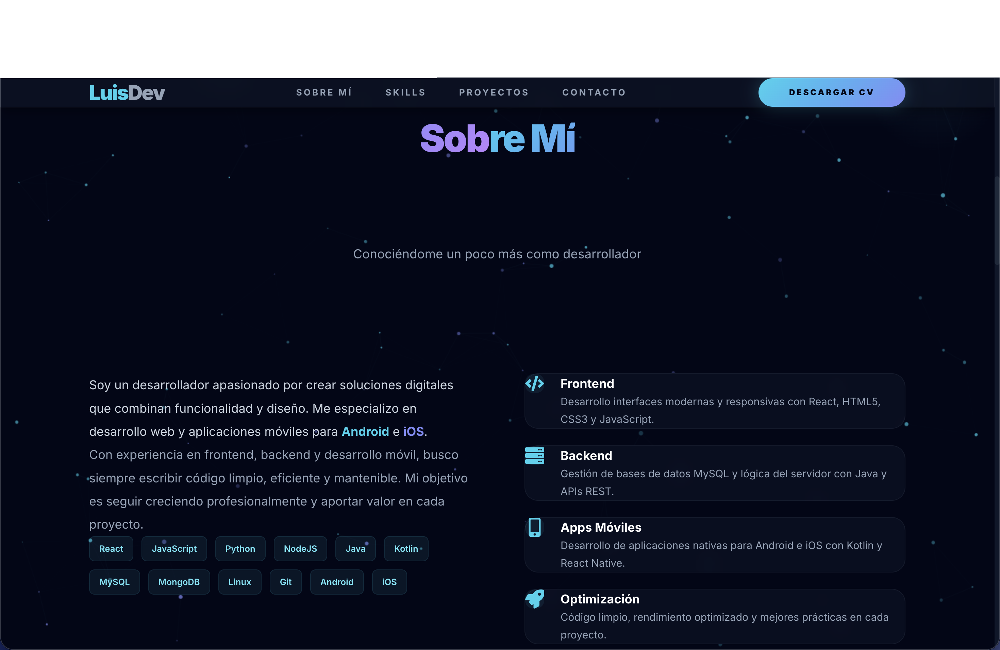
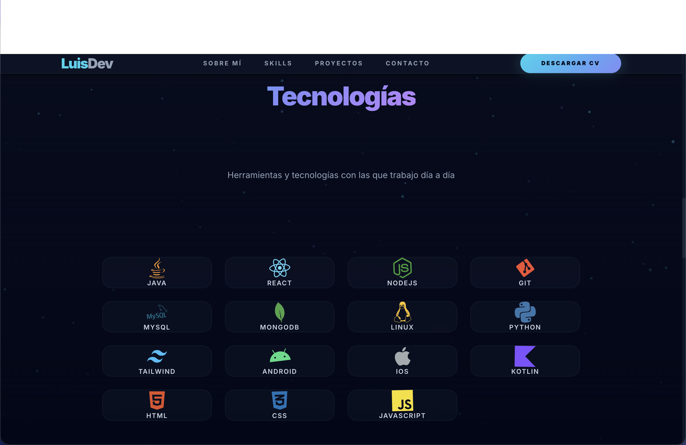

# 🚀 Luis Parra | Full Stack Developer & Mobile Expert

  

---

## 📌 Sobre el Proyecto

Este es mi portafolio profesional, diseñado para mostrar mis habilidades en el desarrollo de aplicaciones web y móviles. Me enfoco en crear experiencias de usuario excepcionales con interfaces modernas, funcionales y un código limpio y optimizado.

### ✨ Características Principales

- **Diseño Ultra Moderno:** Interfaz basada en glassmorphism y animaciones fluidas con Framer Motion.
- **Mobile First:** Totalmente responsivo para una navegación perfecta en cualquier dispositivo.
- **Secciones Detalladas:** Hero interactivo, biografía, stack tecnológico dinámico y contacto.
- **Rendimiento:** Desarrollado con React y Vite para una velocidad de carga instantánea.

---

## 🚀 Proyectos Destacados

### 👻 La Previa Maldita

Plataforma web de juegos interactivos con temática de terror.

- **Tecnologías:** HTML, CSS, JavaScript, PHP
- [Ver en GitHub](https://github.com/Luisparrach22/La_Previa_Maldita)

### 🚀 Portfolio Personal

Este portfolio con diseño moderno y animaciones fluidas.

- **Tecnologías:** React, Tailwind CSS, Framer Motion
- [Ver Repositorio](https://github.com/Luisparrach22)

---

## 👨‍💻 Sobre Mí

  

Soy un desarrollador apasionado por crear soluciones digitales que combinan funcionalidad y diseño. Me especializo en el desarrollo de aplicaciones para **Android e iOS**, así como en sistemas web modernos. Mi objetivo es siempre aportar valor a través de la optimización y el código de calidad.

---

## 🛠️ Tecnologías y Herramientas

  

### Frontend & Mobile

### Backend & Databases

### OS & Herramientas

---

## 📬 Hablemos

Si tienes un proyecto en mente o simplemente quieres saludar, ¡no dudes en contactarme!

---

Desarrollado con ❤️ por Luis Parra

